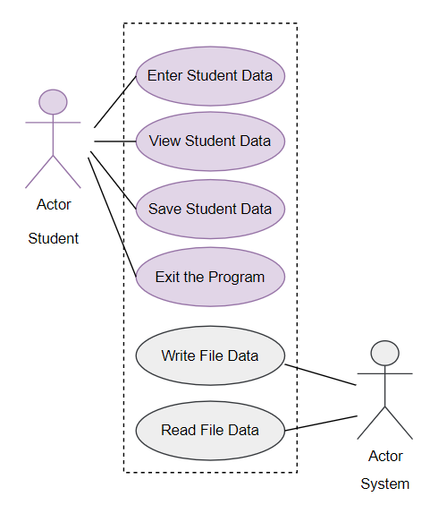
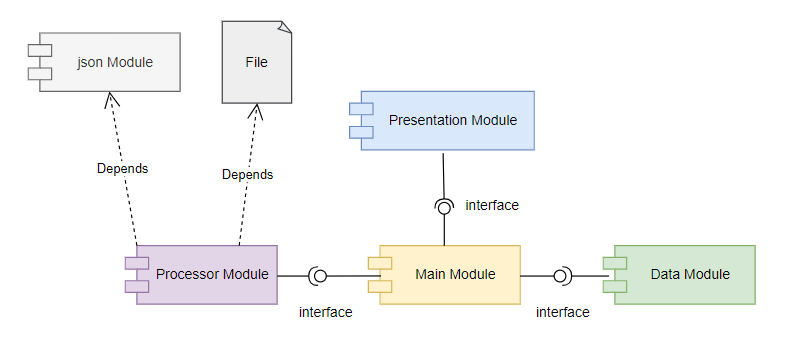
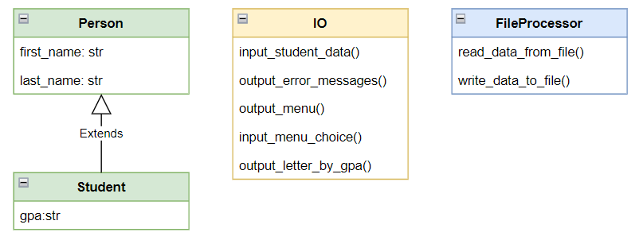

# Application Documentation 
Here is an explanation of our application's code. 

**Note:** This documentation was created using ChatGPT (with some edits, of course.)

**Query =** "Please provide markdown documentation for the following classes..."

---

Our application allows users to enter and track the GPAs for our students. A teacher can enter 
a student name and GPA, view the current data, then save that data to a file for safe keeping. 
Our system handles the ready and saving of the file. 



Our application consists for several components, each based on the separation of concerns.



Within each of the module components are the classes that organize our code. 




# Class Documentation

--- 

## Person and Student
This documentation provides information about two classes: `Person` and `Student`. These classes represent individuals and students with properties for names and GPA. Below, you will find detailed descriptions of both classes, including their attributes and methods.


### Description

The `Person` class represents an individual with attributes for the first name and last name.

### Attributes

- `first_name` (str): The first name of the person.
- `last_name` (str): The last name of the person.

### Methods

#### `__init__(self, first_name: str = "", last_name: str = "")`

- Initializes a new `Person` object.
- Parameters:
  - `first_name` (str, optional): The first name of the person. Defaults to an empty string.
  - `last_name` (str, optional): The last name of the person. Defaults to an empty string.

#### `__str__(self) -> str`

- Returns a formatted string representation of the `Person` object in the following format: "First Name,Last Name."

### Property Methods

#### `first_name (property)`

- Retrieves the first name of the person with the first letter capitalized.

#### `first_name (setter)`

- Sets the first name of the person.
- Validates that the name contains alphabetic characters or is an empty string.
- Raises a `ValueError` if non-alphabetic characters are present in the name.

#### `last_name (property)`

- Retrieves the last name of the person with the first letter capitalized.

#### `last_name (setter)`

- Sets the last name of the person.
- Validates that the name contains alphabetic characters or is an empty string.
- Raises a `ValueError` if non-alphabetic characters are present in the name.


## Student Class (Inherits from Person)

### Description

The `Student` class is a subclass of `Person` and represents a student with an additional attribute: `gpa` (Grade Point Average).

### Attributes

- `first_name` (str): The first name of the student (inherited from `Person`).
- `last_name` (str): The last name of the student (inherited from `Person`).
- `gpa` (float): The GPA (Grade Point Average) of the student.

### Methods

#### `__init__(self, first_name: str = "", last_name: str = "", gpa: float = 0.0)`

- Initializes a new `Student` object.
- Parameters:
  - `first_name` (str, optional): The first name of the student. Defaults to an empty string.
  - `last_name` (str, optional): The last name of the student. Defaults to an empty string.
  - `gpa` (float, optional): The GPA of the student. Defaults to 0.0.

#### `__str__(self) -> str`

- Returns a formatted string representation of the `Student` object in the following format: "First Name,Last Name,GPA."

### Property Method

#### `gpa (property)`

- Retrieves the GPA of the student.

#### `gpa (setter)`

- Sets the GPA of the student.
- Validates that the GPA is a numeric value (float).
- Raises a `ValueError` if an invalid value is provided.

## Example Usage

Here's how you can use these classes:

```python
# Create a Person object
person = Person("John", "Doe")
print(person)  # Output: "John,Doe"

# Create a Student object
student = Student("Alice", "Smith", 3.5)
print(student)  # Output: "Alice,Smith,3.5"

# Set and get the GPA for a student
student.gpa = 3.8
print(student.gpa)  # Output: 3.8
```
---

## FileProcessor Class
This documentation provides information about the `FileProcessor` class. The `FileProcessor` class contains a static method, `write_data_to_file`, that writes student data to a file in JSON format.

### Description

The `FileProcessor` class provides a utility for writing student data to a file in JSON format.

### Static Method

#### `write_data_to_file(file_name: str, student_data: list)`

- Writes a list of student data to a JSON file.
- Parameters:
  - `file_name` (str): The name of the file to which the data will be written.
  - `student_data` (list): A list of student objects containing first name, last name, and GPA.
- Exceptions:
  - `TypeError`: Raised if the data is not in a valid JSON format.
  - `Exception`: Raised for non-specific errors.
- File Handling:
  - The method opens the specified file in write mode (`"w"`) and writes the student data in JSON format.
  - It uses the `json.dump` method to serialize the data into JSON.
- Closing File:
  - The method ensures that the file is closed properly in a `finally` block to prevent resource leaks.
- Output Error Messages:
  - If an exception is raised, the `IO.output_error_messages` method is called with an appropriate error message and exception details.

### Example Usage

Here's how you can use the `FileProcessor` class to write student data to a file:

```python
# Import the FileProcessor class
from your_module import FileProcessor

# Student data
student_data = [
    {"first_name": "Alice", "last_name": "Smith", "gpa": 3.5},
    {"first_name": "Bob", "last_name": "Johnson", "gpa": 3.2}
]

# File name
file_name = "student_data.json"

# Write student data to the file
try:
    FileProcessor.write_data_to_file(file_name, student_data)
    print("Student data has been successfully written to the file.")
except Exception as e:
    print(f"An error occurred: {str(e)}")

```

---

## IO Class
This documentation provides information about the `IO` class. The `IO` class is a collection of presentation layer functions that manage user input and output in the application. It includes functions for displaying error messages, inputting data, and outputting student data.

### Description

The `IO` class contains utility functions for handling user input and displaying output in the application. It is responsible for managing the presentation layer of the application.

### Static Methods

#### `output_error_messages(message: str, error: Exception = None)`

- Displays a custom error message to the user.
- Parameters:
  - `message` (str): The error message to be displayed.
  - `error` (Exception, optional): The exception object (if any) associated with the error.
- Output:
  - The error message is printed to the console, followed by technical error details if provided.

#### `input_data_to_table(student_data: list)`

- Gets data from the user and adds it to a list of dictionary rows containing student data.
- Parameters:
  - `student_data` (list): A list of dictionary rows containing the current student data.
- User Input:
  - The function prompts the user to enter the student's first name, last name, and GPA.
- Error Handling:
  - It handles exceptions such as `ValueError` for invalid input and displays error messages using the `output_error_messages` function.
- Return Value:
  - Returns the updated list of dictionary rows containing the new student data.

#### `output_student_data(student_data: list)`

- Displays student data from the list of dictionary rows.
- Parameters:
  - `student_data` (list): A list of dictionary rows containing student data.
- Output:
  - The function iterates through the list of students and prints their first name, last name, and GPA.

### Example Usage

Here's how you can use the `IO` class to interact with user input and student data:

```python
# Import the IO class and other necessary components
from your_module import IO, Student

# Initialize an empty list for student data
student_data = []

# Add student data to the list
student_data = IO.input_data_to_table(student_data)

# Display student data
IO.output_student_data(student_data)
```


